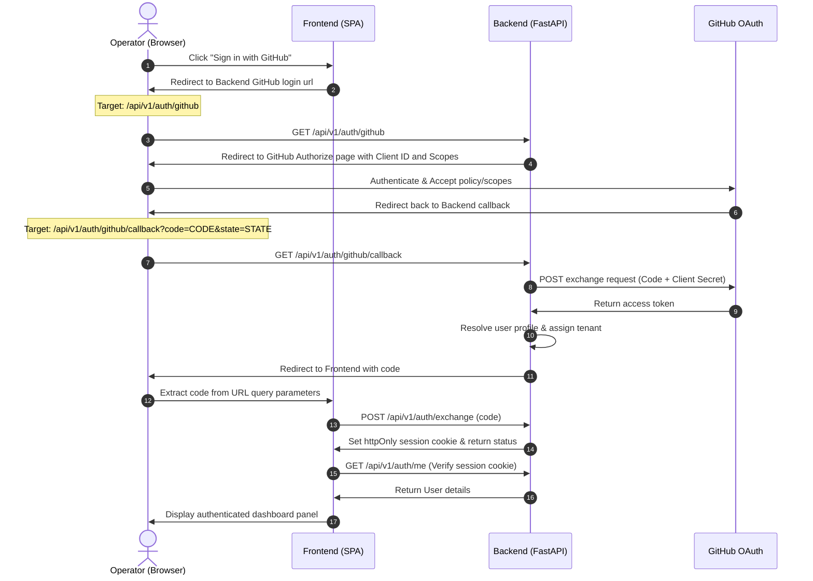

# GitHub OAuth Setup & Integration Guide 🔑

This guide outlines how to configure, register, and connect a GitHub OAuth application to the Fire Crow backend.

---

## 1. Register a GitHub OAuth Application

To enable GitHub login on your Fire Crow deployment, you must register a new OAuth Application in your GitHub developer settings.

### Step-by-Step Instructions:
1. Log in to your GitHub account and navigate to **Settings** > **Developer Settings** > **OAuth Apps**.
2. Click **Register a new application** (or **New OAuth App**).
3. Fill out the application details:
   - **Application Name:** `Fire Crow (or your preferred name)`
   - **Homepage URL:** The base URL of your frontend application (e.g., `http://localhost:5173` in development, or `https://app.firecrow.dev` in production).
   - **Application Description:** (Optional) Enter a brief description.
   - **Authorization callback URL:** The redirect endpoint on your backend application where GitHub sends the authorization code.
     - **Development default:** `http://localhost:8000/api/v1/auth/github/callback`
     - **Production default:** `https://your-api.firecrow.dev/api/v1/auth/github/callback`
4. Click **Register application**.
5. Once registered, copy the **Client ID**.
6. Under **Client secrets**, click **Generate a new client secret** and copy the generated secret key immediately (it will not be shown again).

---

## 2. Configure Fire Crow Environment Variables

Once you have your **Client ID** and **Client Secret**, configure your backend to use them.

Open or create your `backend/.env.local` file and add the following lines:

```bash
# GitHub App Authentication Credentials
GITHUB_CLIENT_ID="your_copied_client_id"
GITHUB_CLIENT_SECRET="your_copied_client_secret"

# Redirect / callback routing configuration
BACKEND_BASE_URL="http://localhost:8000" # Your FastAPI base URL
FRONTEND_URL="http://localhost:5173"     # Your Vite+React frontend URL
```

---

## 3. GitHub OAuth Sequence & Flow

The authentication flow follows the standard Authorization Code grant type:



### OAuth Scopes Configured by Default
The backend requests the following scopes to inspect repositories, register issue mappings, and run hooks:
- `repo` (Full control of private repositories)
- `workflow` (Required to read/write Actions workflow files)
- `read:org` (Read organization details for tenant grouping)
- `user:email` (Access profile emails)
