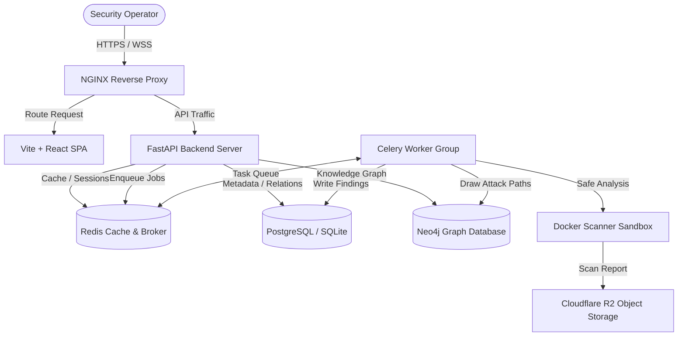

# Fire Crow 🐦‍⬛

> **Agentic Security Intelligence Platform**

Fire Crow is an enterprise-grade agentic security intelligence platform that coordinates sandboxed LLM agents to map target repositories, execute safe exploit simulations, track vulnerabilities, and compile compliance-ready security intelligence reports.

Built with a secure-by-default architecture, Fire Crow supports multi-tenant isolation, multi-factor authentication (MFA), single sign-on (SSO), privileged access management (PAM), and robust resilience patterns such as rate-limiting, custom circuit breakers, and sandboxed analysis environments.

---

## 🛠️ Architecture & Technology Stack

Fire Crow is designed as a decoupled, multi-container system that prioritizes security isolation and modular databases.



### Backend
- **Core Framework:** [FastAPI](https://fastapi.tiangolo.com/) (Python 3.12+)
- **Task Orchestration:** [Celery](https://docs.celeryq.dev/) with [Redis](https://redis.io/) broker
- **AI Agent Orchestration:** [LangGraph](https://github.com/langchain-ai/langgraph) & [LangChain](https://github.com/langchain-ai/langchain) powered by **Google Gemini Pro & Flash** models
- **Databases:**
  - **Relational:** [PostgreSQL](https://www.postgresql.org/) (Production) & [SQLite](https://www.sqlite.org/) (Development / Testing) via **SQLAlchemy 2.0** and **Alembic** migrations
  - **Graph:** [Neo4j](https://neo4j.com/) (for modeling complex attack paths and dependency graphs)
- **Document Generation:** [WeasyPrint](https://weasyprint.org/) (HTML-to-PDF compiler for security audit reports)
- **Object Storage:** [Cloudflare R2 / AWS S3](https://aws.amazon.com/s3/) for security artifacts and PDF persistence

### Frontend
- **Framework:** [Vite](https://vitejs.dev/) + [React](https://react.dev/) + [TypeScript](https://www.typescriptlang.org/)
- **Styling:** Premium glassmorphic interface built using Vanilla CSS tokens, offering an immersive dashboard, live logging feeds, and compliance management views.

---

## ✨ Features & Capabilities

1. **Agentic Auditing & Sandbox Execution**
   - Autonomous security agents plan and scan remote Git repositories.
   - Analysis tools and code scanners execute safely inside ephemeral sandboxed Docker containers (`ghcr.io/johan-droid/firecrow-scanner`).
   - Generates Interactive Attack Graphs using PostgreSQL or Neo4j.
   - Provides live Server-Sent Events (SSE) streaming of agent logs and progress.

2. **Enterprise Security & Compliance**
   - **Multi-Tenant Isolation:** Dynamic middleware intercepts all routes to enforce strict logical database segregation, scoping users, audits, and storage per tenant.
   - **Multi-Factor Authentication (MFA):** Cryptographically enforced TOTP (Authenticator Apps) featuring encrypted database storage, recovery code systems, and mandatory activation for administrators.
   - **Single Sign-On (SSO):** Support for GitHub & Google OAuth, SAML integration, auto-provisioning rules, and custom role mappings.
   - **Privileged Access Management (PAM):** Time-bound elevated access requests, strict approvals, limit bounds on pending actions, and automatic cron cleanups.
   - **Service Accounts:** Granular service token creation supporting scoped API permissions and expiration dates.
   - **Built-in Resilience:** Custom Circuit Breaker implementation guarding database, storage, and AI providers. Rate-limiting enforced per IP/User via SlowAPI.
   - **Hardened Web Security:** Robust CSRF validation, strict Content Security Policy (CSP), HSTS headers, and payload size restriction middleware.

---

## 📂 Repository Structure

```text
├── backend/                   # FastAPI Backend
│   ├── alembic/               # Database migration files
│   │   └── versions/          # Individual database schema migration scripts
│   ├── app/                   # Backend application source code
│   │   ├── agents/            # LangGraph security auditing agent pipelines
│   │   ├── api/               # Router endpoints (auth, audit, mfa, sso, tenant, etc.)
│   │   ├── graph/             # Neo4j query helper modules
│   │   ├── middleware/        # Security, tenant, CSRF, and telemetry middleware
│   │   ├── models/            # SQLAlchemy database tables & database connection
│   │   ├── schemas/           # Pydantic validation schemas
│   │   ├── services/          # Business logic layers (MFA, Storage, Housekeeping, etc.)
│   │   ├── utils/             # Helper tools, circuit breakers, and custom exception handlers
│   │   ├── workers/           # Celery application & worker setups
│   │   ├── config.py          # App settings parsing environment variables
│   │   ├── main.py            # Main FastAPI startup script
│   │   └── openapi.yaml       # OpenAPI Specification YAML file
│   ├── deploy/                # Infrastructure & Docker configuration
│   ├── tests/                 # Comprehensive Pytest suite
│   └── requirements.txt       # Python backend dependencies
│
├── frontend/                  # React + Vite Frontend
│   ├── src/                   # React components, styles, and dashboard logic
│   │   ├── assets/            # Static image assets
│   │   ├── App.tsx            # Main frontend router & view dispatcher
│   │   ├── index.css          # Glassmorphic custom CSS variable layout
│   │   └── main.tsx           # SPA bootstrapping script
│   ├── package.json           # Frontend Node dependencies
│   └── vite.config.ts         # Vite configuration options
│
├── package.json               # Monorepo/Workspace runner config
├── GITHUB_AUTH.md             # OAuth connection instructions
├── API_DOCUMENTATION.md       # Raw HTTP Endpoint Reference
└── README.md                  # This file
```

---

## ⚙️ Configuration & Environment Variables

Create a `backend/.env.local` or setup environment variables. Below are the most critical variables:

| Variable | Type | Default | Description |
| :--- | :--- | :--- | :--- |
| **`DEBUG`** | Boolean | `false` | Enable/disable debug mode (SQLite fallbacks, relaxed CORS). |
| **`SECRET_KEY`** | String | *Required* | Min 32-character key for JWT signing & cookies. |
| **`ENCRYPTION_KEY`** | String | *Required* | Min 32-character key for database secret encryption (MFA secrets, API keys). |
| **`FRONTEND_URL`** | String | *Required* | Origin URL of frontend interface. Used in CORS/CSRF. |
| **`DATABASE_BACKEND`** | String | `postgresql` | Database type: `postgresql` or `neo4j`. |
| **`DATABASE_URL`** | String | *Required* | Connection string to PostgreSQL database. |
| **`NEO4J_URI`** | String | `""` | Connection string for Neo4j (if Neo4j backend active). |
| **`REDIS_URL`** | String | *Required* | Redis connection string (e.g. `redis://:pass@localhost:6379/0`). |
| **`GEMINI_API_KEY`** | String | *Required* | Google Gemini API credential for agent orchestration. |
| **`GITHUB_CLIENT_ID`** | String | `""` | GitHub OAuth client ID. |
| **`GITHUB_CLIENT_SECRET`**| String | `""` | GitHub OAuth client secret. |
| **`R2_ENDPOINT_URL`** | String | `""` | Endpoint for Cloudflare R2 object storage bucket. |
| **`SMTP_HOST`** | String | `smtp.gmail.com` | SMTP Server Host for PDF emailing. |

---

## 🚀 Quickstart & Development Setup

### Prerequisites
- [Python 3.12+](https://www.python.org/)
- [Node.js 20+](https://nodejs.org/)
- [Docker](https://www.docker.com/) (Required for running sandboxed audits and multi-container deployment)

### 1. Install Workspace Dependencies
From the repository root, install monorepo script runner dependencies and frontend components:
```bash
npm install
npm run build
```

### 2. Configure Environment Files
Copy example environment templates to setup your credentials:
```bash
# In the backend directory
cp backend/.env backend/.env.local
```
Update critical API keys (`GEMINI_API_KEY`, `GITHUB_CLIENT_ID`, `GITHUB_CLIENT_SECRET`, `SECRET_KEY`, `ENCRYPTION_KEY`) in `backend/.env.local`.

### 3. Run Locally in Development Mode
You can spin up both backend and frontend development servers concurrently using:
```bash
npm run dev
```
- **Frontend** will be running at: [http://localhost:5173](http://localhost:5173)
- **FastAPI API** will be running at: [http://localhost:8000](http://localhost:8000)
- **Interactive OpenAPI Documentation:** [http://localhost:8000/docs](http://localhost:8000/docs)

---

## 🧪 Testing

Fire Crow comes with a comprehensive suite of unit, integration, and stress tests. Tests automatically spin up database mock contexts and test dependencies.

To execute tests:
```bash
cd backend
# Activate virtual environment
.venv\Scripts\activate
# Run pytest
pytest
```

---

## 🚢 Production Deployment

### Docker Compose
For multi-container orchestrations (PostgreSQL + Redis + Celery + FastAPI Server + NGINX load balancer), deployment configurations are provided inside `backend/deploy`.

To deploy:
```bash
cd backend/deploy
# Create your .env file in the deployment directory with required passwords and keys
docker-compose up -d --build
```

---

## 📖 API Documentation

A detailed endpoint directory, parameter specs, schema payloads, and integration guidelines can be found in [API_DOCUMENTATION.md](./API_DOCUMENTATION.md).
