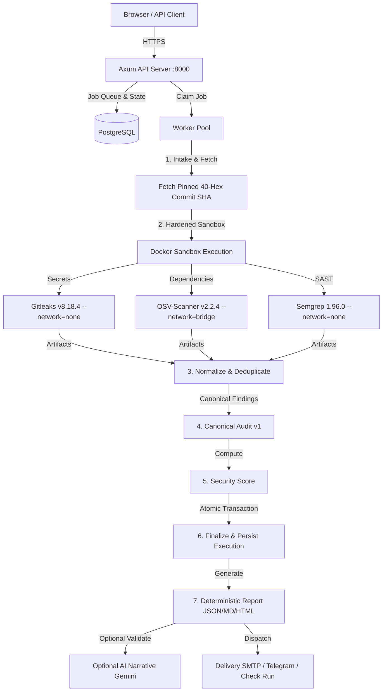

# Fire Crow — Backend Reference (CANONICAL)

One document. The single high-level description of the implemented backend.
Operational detail lives in the linked documents — not duplicated here.

| Topic | Document |
|---|---|
| Release evidence & RC gate | `RELEASE_CANDIDATE.md` / `RELEASE_GATE.md` |
| Production topology & config | `PRODUCTION_DEPLOYMENT.md` |
| GitHub App operations | `GITHUB_APP.md` |
| Frontend API contract | `FRONTEND_CONTRACT.md` |
| Adversary model | `THREAT_MODEL.md` |
| Gemini transport contract | `LLM_PROVIDER.md` |

---

## 1. Purpose

Fire Crow audits a GitHub repository for committed secrets, dependency
vulnerabilities, and source-code weaknesses, then renders a **deterministic,
evidence-backed report** reproducible byte-for-byte from the database alone.
Nothing is reported that did not come out of a scanner.

## 2. Security pipeline



## 3. Security boundary

- **Scanners are the security source of truth.** A finding exists only if a
  scanner emitted it with a location and evidence.
- **AI cannot** create findings, change severity, invent evidence, invent
  CVE/CWE/OWASP references, or change coverage. Every narrative field is
  validated against the exact report it explains; refusal is legitimate.
- **The deterministic report remains authoritative.** AI failure, delivery
  failure, or optional-service outage leaves it untouched.
- Failure is never recorded as clean: crashed, timed-out, cancelled, or
  unparseable scanners are *unknown coverage*.

## 4. Scanner inventory

| Tool | Image (pinned) | Purpose | Network | Output | Failure semantics |
|---|---|---|---|---|---|
| Gitleaks | `ghcr.io/gitleaks/gitleaks:v8.18.4` | committed secrets | `none` | JSON artifact (`gitleaks-json-v1`) | exit 1 + valid report = success; missing/broken report = FAILED |
| OSV-Scanner | `ghcr.io/google/osv-scanner:v2.2.4` | dependency advisories (npm + crates.io, direct & transitive) | `bridge` — the **sole declared exception**, for the live advisory DB | JSON artifact (`osv-json-v1`) | unparseable/empty output = FAILED, never clean |
| Semgrep | `semgrep/semgrep:1.96.0` | source-code SAST | `none` | JSON artifact (`semgrep-json-v1`) | zero analyzed files (`no_files_analyzed`) = FAILED, never clean |

All three use the local pinned ruleset/config; registry rulesets are never
fetched (reproducibility). Normalization preserves rule/check id, scanner
metadata (CWE/OWASP/confidence **only where supplied**), native fingerprint,
and a bounded, redacted evidence snippet.

## 5. Sandbox model

Every scan runs in its own container: repository mounted read-only at
`/scan`; writable scratch is in-memory tmpfs (`/work` 64M, extras 32M);
`--network=none` default (OSV alone declares `bridge`); `--read-only` rootfs;
`--cap-drop=ALL`; `--security-opt=no-new-privileges`; `--user=65534:65534`;
`--pids-limit`; `--cpus`/`-m` with `--memory-swap` pinned equal; per-scanner
wall-clock timeout; stdout/stderr byte caps (stderr is redacted before
logging — it echoes repository content); cooperative cancellation consulted
continuously. Pure argv construction (`docker_argv`) keeps the boundary
unit-testable without Docker.

## 6. Canonical Audit v1

- **Canonical identity:** scanner + rule id + native fingerprint +
  normalized location + evidence digest — exact-identity dedupe only;
  distinct findings are never merged.
- **Provenance:** scanner name, version, parser id, image per run.
- **Evidence validation:** file path, positive line, bounded snippet;
  invalid findings quarantined (counted, excluded, never repaired).
- **Coverage:** `complete | partial | failed` from scanner runs; **score is
  null unless coverage is complete**; failure is explicit.
- **Execution identity:** every audit belongs to exactly one execution.

## 7. Execution lifecycle & Retries

```mermaid
graph TD
    subgraph Execution Lifecycle
        Job[Audit Job] --> Attempt[Execution Attempt N]
        Attempt --> Fetch[1. Fetch Pinned Commit SHA]
        Fetch --> Scan[2. Scanner Runs Gitleaks / OSV / Semgrep]
        Scan --> Norm[3. Normalization Canonical Audit v1]
        Norm --> Score[4. Deterministic Scoring]
        Score --> Finalize[5. Atomic Finalization Single SQL Tx]
        Finalize --> Report[6. Deterministic Report Generation]
        Report --> Narrative[7. Optional AI Narrative]
        Narrative --> Delivery[8. Delivery & GitHub Check Run]
    end
```



### Retry Invariant

Retries create **separate execution identities** (attempt $N+1$). A retry never mutates a previous attempt's rows:

```mermaid
graph TD
    Job[Audit Job]
    Job --> Exec1["Execution 1 (Attempt 1) — Failed / Frozen"]
    Job --> Exec2["Execution 2 (Attempt 2) — Cancelled / Frozen"]
    Job --> Exec3["Execution 3 (Attempt 3) — Completed / Immutable"]

    style Exec1 fill:#2d1515,stroke:#ff453a
    style Exec2 fill:#2d2515,stroke:#ffd60a
    style Exec3 fill:#152d15,stroke:#30d158
```



## 8. Persistence guarantees

- **Atomic finalization:** findings, scanner runs, coverage, report, and
  status commit in one transaction — no half-finalized audits.
- **Terminal immutability:** enforced by database triggers, not app
  convention; terminal execution/report rows cannot be rewritten.
- **Execution-scoped records:** findings, reports, narratives, deliveries
  keyed by `execution_id`; cross-attempt mixing is impossible.
- **Cancellation:** cooperative; cancelled executions terminate with their
  own status, never as success.
- **Reaper/recovery:** heartbeat leases; dead-worker jobs reaped and
  re-attempted with history preserved; live workers never reaped.

## 9. GitHub App

Installation identity → per-job installation-token exchange (never
persisted) → ownership verification (installation must own the repository).
Webhooks: HMAC-SHA256 verification, delivery-ID dedup (`ON CONFLICT DO
NOTHING` — a redelivery finds the existing job, never queues a second),
push/PR audits a **pinned SHA**, and a `firecrow-security-audit` Check Run
reports status/conclusion/coverage on that SHA (status only, no inline
annotations). Crash between "job created" and "delivery marked processed"
is a duplicate ack, not a duplicate job.

## 10. AI narrative (optional)

Input = the deterministic report only (no repository files, no evidence, no
network). Output passes schema validation, invented-finding rejection (every
explained finding must exist with matching identity), and semantic tampering
rejection (score/coverage/severity claims must match the report). Narrative
is persisted separately from the report. Provider: Gemini via an isolated
transport (`LLM_PROVIDER.md`); unset credential = `NotConfigured` = audit
proceeds without narrative.

**Live Gemini smoke: PENDING — credential gated.**

## 11. Delivery

- **Email (SMTP)** and **Telegram** — both optional, execution-scoped.
- Idempotency key `(execution, channel, destination, version)` is the PK;
  state machine `queued → sending → sent|failed` enforced in the database.
- Destination comes from the account record or operator config — a request
  body can never redirect a report (Telegram hijack → 501).
- Delivery failure is recorded on the delivery row; the deterministic
  report is never mutated by a delivery outcome. Resend = new version,
  history stays additive.

## 12. Production RC status

```text
Backend architecture: FROZEN
Release status:       CONTROLLED-BETA CANDIDATE
Gemini live smoke:    PENDING — credential gated
Production soak:      PENDING at full scale (burst gate proven)
```

Proven (see `RELEASE_CANDIDATE.md`): fmt clean; clippy `-D warnings` clean;
startup/migrations 12/12; backpressure burst exact; live Gitleaks, OSV
(5 fixtures), Semgrep (3 fixtures) end-to-end; canonical persistence and
byte-identical report reconstruction; GitHub App; kill/recovery; delivery
idempotency; secret-safe Debug; cargo audit classified.
**Not claimed:** full public production readiness.

## 13. Frontend boundary

`documentation/FRONTEND_CONTRACT.md` is the API contract. The frontend must:

- consume execution-scoped APIs only;
- never mix attempts (one narrative/report per execution);
- never recreate scanner or scoring business logic;
- never generate canonical findings;
- never present a failed/partial scan as zero findings.

## 14. Operational documentation

See the table at the top of this document. Those files are authoritative for
their topic; this document does not duplicate them.
