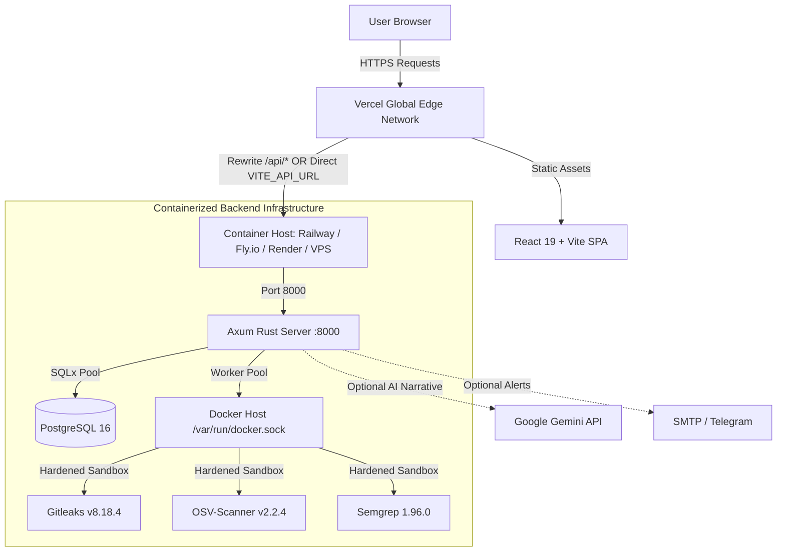

# 🚀 Vercel Deployment & Integration Guide — Fire Crow

This guide covers deploying the **Fire Crow** platform with **Vercel** hosting the frontend Single Page Application (SPA) paired with a containerized **Rust Axum** backend.

---

## 🏗️ Architecture & Deployment Model



### Why This Hybrid Architecture?

| Component | Hosted On | Rationale |
| :--- | :--- | :--- |
| **Frontend** | **Vercel** | Instant global edge CDN distribution, automatic preview deployments, zero-maintenance SPA hosting, and automatic HTTPS. |
| **Backend** | **Container Host** (Railway, Fly.io, Render, VPS) | FireCrow's worker pipeline executes security scanners (**Gitleaks**, **OSV-Scanner**, **Semgrep**) inside hardened Docker containers (`docker run`). Vercel Serverless Functions (AWS Lambda) **do not have a Docker daemon** or nested container support, and enforce short execution timeouts that cannot sustain multi-scanner pipelines. |

---

## ⚡ 1. Frontend Deployment to Vercel

The repository is configured for turnkey Vercel deployment with pre-configured `vercel.json` files supporting both repository-root and `frontend/` subdirectory imports.

### Option A: Monorepo Root Deployment (Default)

When importing the entire `Fire-Crow-` repository into Vercel without changing the root directory:

1. Import the repository in **Vercel Dashboard > Add New Project**.
2. Leave **Root Directory** set to `./` (root).
3. Vercel automatically detects the root [`vercel.json`](file:///home/ashutoshsahoo/Downloads/Fire-Crow-/vercel.json):
   - **Framework Preset**: `Vite`
   - **Build Command**: `npm --prefix frontend run build` (or `npm run vercel-build`)
   - **Output Directory**: `frontend/dist`
4. Set Environment Variables (see Section 2).
5. Click **Deploy**.

### Option B: Frontend Subdirectory Deployment

If you prefer pointing Vercel specifically to the frontend directory:

1. Import the repository in **Vercel Dashboard > Add New Project**.
2. Set **Root Directory** to `frontend`.
3. Vercel detects [`frontend/vercel.json`](file:///home/ashutoshsahoo/Downloads/Fire-Crow-/frontend/vercel.json):
   - **Framework Preset**: `Vite`
   - **Build Command**: `npm run build`
   - **Output Directory**: `dist`
4. Set Environment Variables (see Section 2).
5. Click **Deploy**.

### Option C: Vercel CLI Deployment

Deploy directly from your terminal using the Vercel CLI:

```bash
# 1. Install Vercel CLI
npm install -g vercel

# 2. Login to Vercel
vercel login

# 3. Deploy preview build
vercel

# 4. Deploy production build
vercel --prod
```

---

## ⚙️ 2. Environment Variables & API Routing

### Frontend Environment Variables (Vercel Project Settings)

Add these under **Vercel Dashboard > Project Settings > Environment Variables**:

| Variable | Recommended Value | Purpose |
| :--- | :--- | :--- |
| `VITE_API_URL` | `https://api.yourdomain.com/api/v1` or `/api/v1` | Base API URL consumed by `frontend/src/App.tsx`. |
| `VITE_APP_NAME` | `Fire Crow Security Console` | Display name in the browser console. |

### API Routing Strategies

#### Strategy 1: Vercel Rewrites (Same-Origin Reverse Proxy)
In [`vercel.json`](file:///home/ashutoshsahoo/Downloads/Fire-Crow-/vercel.json), replace `https://api.firecrow.dev` with your backend domain:
```json
{
  "rewrites": [
    {
      "source": "/api/:match*",
      "destination": "https://api.yourdomain.com/api/:match*"
    },
    {
      "source": "/(.*)",
      "destination": "/index.html"
    }
  ]
}
```
*Benefits*: The browser talks only to your Vercel domain; eliminates cross-origin CORS configuration and first-party cookie restrictions.

#### Strategy 2: Direct API URL
Set `VITE_API_URL` to your full backend API URL (e.g. `https://firecrow-backend.railway.app/api/v1`).
*Requirements*: The backend must include your Vercel domain in its `FRONTEND_URL` and `CORS_ORIGINS` environment variables.

---

## 🐳 3. Backend Deployment (Container Host)

The backend provides a production-ready multi-stage [`backend/Dockerfile`](file:///home/ashutoshsahoo/Downloads/Fire-Crow-/backend/Dockerfile) and [`docker-compose.yml`](file:///home/ashutoshsahoo/Downloads/Fire-Crow-/docker-compose.yml).

### Option A: Railway / Render / Fly.io

1. Create a new service from your Git repository.
2. Set the Dockerfile path to `Dockerfile` (root) or `backend/Dockerfile`.
3. Ensure the container host has access to the Docker daemon (or deploy via a Docker VPS/Droplet if rootless containers are restricted).
4. Configure required backend environment variables.

### Option B: Docker Compose on a VPS (DigitalOcean, Hetzner, AWS EC2)

Deploy the full stack (PostgreSQL + Redis + Axum Backend) using the included [`docker-compose.yml`](file:///home/ashutoshsahoo/Downloads/Fire-Crow-/docker-compose.yml):

```bash
# 1. Clone repository
git clone https://github.com/johan-droid/Fire-Crow-.git
cd Fire-Crow-

# 2. Configure production environment
cat << 'EOF' > .env
POSTGRES_PASSWORD=$(openssl rand -hex 24)
REDIS_PASSWORD=$(openssl rand -hex 24)
SECRET_KEY=$(openssl rand -base64 48)
ENCRYPTION_KEY=$(openssl rand -base64 48)
FRONTEND_URL=https://your-firecrow.vercel.app
CORS_ORIGINS=https://your-firecrow.vercel.app
GEMINI_API_KEY=your_gemini_api_key_if_used
GEMINI_MODEL=gemini-1.5-pro
EOF

# 3. Start stack with Docker daemon socket attached
docker compose up -d --build
```

> ⚠️ **Critical Docker Socket Requirement:**
> The backend container mounts `/var/run/docker.sock` to execute containerized security scanners (`ghcr.io/gitleaks/gitleaks:v8.18.4`, `ghcr.io/google/osv-scanner:v2.2.4`, `semgrep/semgrep:1.96.0`). Without Docker socket access, audits will fail closed with a scanner execution error.

---

## 🔒 4. Backend Environment Variables Checklist

| Variable | Required? | Purpose |
| :--- | :--- | :--- |
| `DATABASE_URL` | **Yes** | PostgreSQL connection string (`postgres://...`). |
| `SECRET_KEY` | **Yes** | Cryptographic key for JWT sessions (≥32 chars, `openssl rand -base64 48`). |
| `ENCRYPTION_KEY` | **Yes** | Key for encrypting sensitive fields (≥32 chars, distinct from `SECRET_KEY`). |
| `FRONTEND_URL` | **Yes** | URL of your deployed Vercel frontend (e.g. `https://your-app.vercel.app`). |
| `CORS_ORIGINS` | **Yes** | Allowed CORS origins, including your Vercel production and preview domains. |
| `PORT` | Optional | Backend listening port (default: `8000`). |
| `HOST` | Optional | Backend listening address (default: `0.0.0.0`). |
| `REDIS_URL` | Optional | Redis connection string for fast-path session cache (falls back to Postgres if omitted). |
| `GEMINI_API_KEY` | Optional | Google Gemini API key for optional narrative explanations. |
| `GEMINI_MODEL` | Optional | Gemini model name (e.g. `gemini-1.5-pro`). |
| `GITHUB_APP_ID` | Optional | GitHub App ID for automatic repo check runs. |
| `GITHUB_APP_PRIVATE_KEY` | Optional | GitHub App private key PEM. |
| `GITHUB_APP_WEBHOOK_SECRET` | Optional | GitHub App webhook HMAC secret. |

---

## 🧪 5. Verification & Health Check

After deploying both tiers:

```bash
# 1. Verify backend health
curl -s -i https://api.yourdomain.com/health
# Expected: HTTP/2 200 OK -> {"status":"ok"}

# 2. Verify Vercel frontend responds
curl -s -i https://your-firecrow.vercel.app
# Expected: HTTP/2 200 OK -> HTML with Vite bundle assets

# 3. Verify API reverse proxy (if using Strategy 1)
curl -s -i https://your-firecrow.vercel.app/api/v1/health
# Expected: HTTP/2 200 OK -> {"status":"ok"}
```
